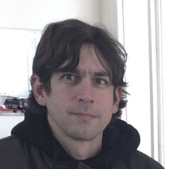
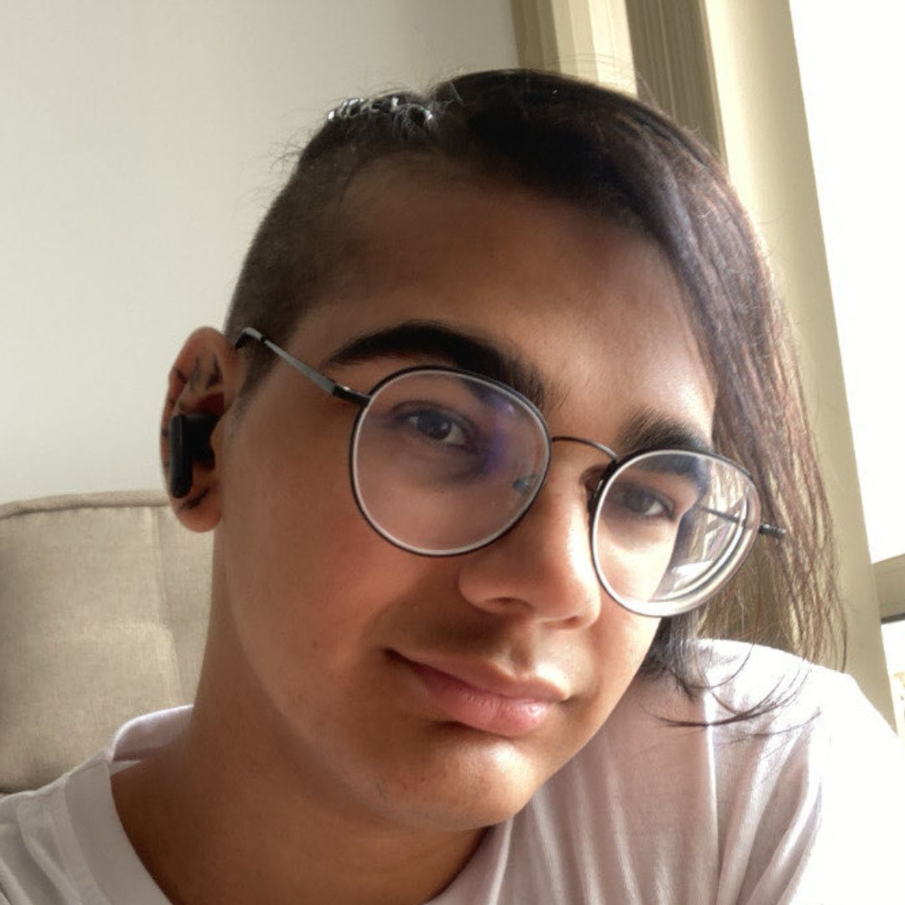
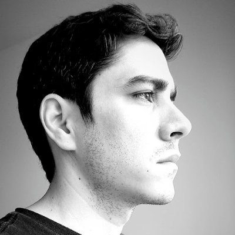
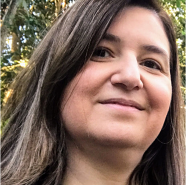

# Equipe da Rede Emílias de Podcasts

## Atual

## Atul com imagens

  

    
    
<strong>Adolfo Neto</strong> Coordenador <em>Desde 01/07/2019</em>

  

  

    
    
<strong>Carolina Vitoriah Ferreira Bruno</strong> Bolsista <em>Desde 26/08/2025</em>

  

  

    
    
<strong>Zoey Pessanha</strong> Apresentadora do Elixir em Foco <em>Desde 30/01/2021</em>

  

  

    
    
<strong>Herminio Torres</strong> Apresentador do Elixir em Foco <em>Desde 30/01/2021</em>

  

  

    
    
<strong>Maria Claudia Emer</strong> Apresentadora do Fronteiras da Engenharia de Software <em>Desde 01/08/2022</em>

  

