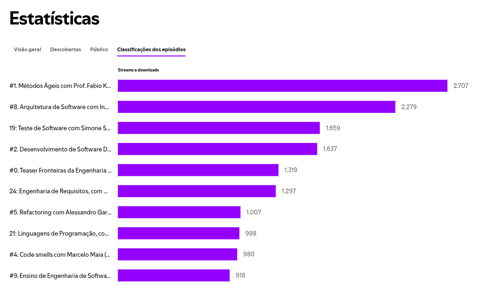
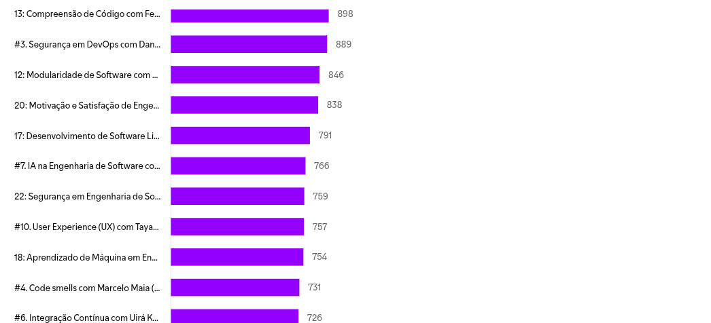

# Estatísticas do Fronteiras da Engenharia de Sofwtare

## YouTube

### 18/09/2025 10:02 

- <https://www.youtube.com/@fronteirases>
  - 25,296 views
  - 1.16K subscribers
  - 88 videos
  - Vídeo com mais views: [Engenharia de missões robóticas, com Genaína Rodrigues (UnB)](https://youtu.be/qghdjPnVxW4?si=YiQd9j1y-8CWfXkC) - 2.2K views
  - Live com mais views: [Mitos e Realidades no Desenvolvimento de Software com IA, Paulo Borba (Cin UFPE) - Esquenta SE4FP](https://www.youtube.com/live/rXP4YUGeIJk?si=s6n6L8EvlXRxls7e) - 856 views

## Spotify for Creators

### 18/09/2025 10:06

- <https://creators.spotify.com/pod/profile/fronteirases/>
  - 43.168 streams e downloads
  - 2.333 seguidores no Spotify
  - Por episódio: 163 (Em média)
  - Tamanho do público: 188 (Últimos 7 dias)

#### Episódios mais escutados

 
